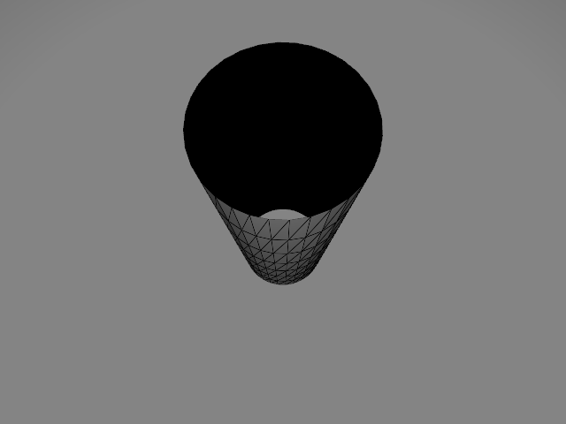

# STLNonManifold

A STL format file checker for non-manifold.

`stl_reader.h` is from [this repository](https://github.com/sreiter/stl_reader).

`./STLNonManifold/stl_models`: there are some stl models for testing.

## Doc
`./STLNonManifold/KDTree.h`: Used to detect and merge similar vertices.

`./STLNonManifold/STLNonManifold.h`:
- namespace `STLNonManifold::Geometry`: there are 3 basic Geometry structs (`Vertex`, `Edge`, `Triangle`) to reconstruct topology of stl file .

- namespace `STLNonManifold`
    - `STLNonManifoldChecker`: construct this class to read stl file and reconstruct its topology. Then use `STLNonManifoldChecker::CheckNonManifold` to print Non-Manifold triangles' information.

## Usage

In `main.cpp`:

```cpp
#include <iostream>

#include "STLNonManifold.h"

int main()
{
    STLNonManifold::STLNonManifoldChecker stlNonManifoldChecker("./stl_models/zhu.stl");
    stlNonManifoldChecker.CheckNonManifold();
}

```

output:
```
verticesCount: 256
edgesCount: 704
trianglesCount: 448
======
NonManifold: 1
Triangle: 1
Edge: 3
Start Vertex: 2
(-0.181963, -0.983305, 0.468412)
End Vertex: 3
(0, -1, 0.468412)
======
======
NonManifold: 1
Triangle: 12
Edge: 25
Start Vertex: 14
(0, -1, 6.58184)
End Vertex: 15
(-0.181963, -0.983305, 6.58184)
======
……
======
NonManifold: 1
Triangle: 446
Edge: 702
Start Vertex: 14
(0, -1, 6.58184)
End Vertex: 255
(0.181963, -0.983305, 6.58184)
======
Check end.
```

zhu.stl:

